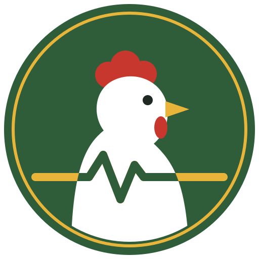
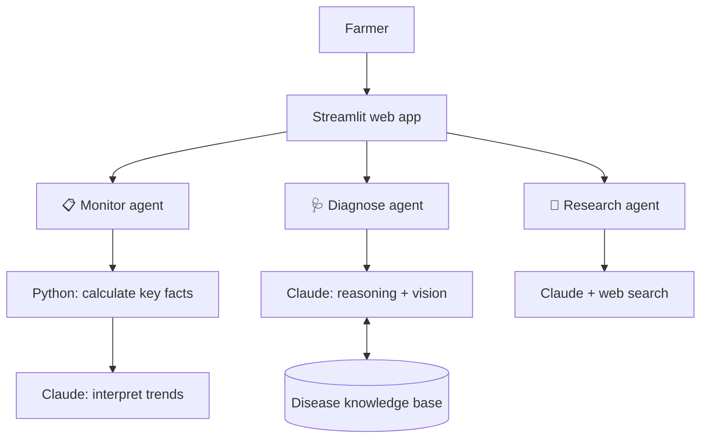

   <p align="center"></p>

   # Mesheco Poultry AI Disease Detector

**A multi-agent AI assistant that helps smallholder poultry farmers in Kenya catch disease early, understand what is making their birds sick, and know what to do next — in English or Swahili.**

Many smallholder farmers cannot easily reach or afford a veterinarian. By the time they seek help, a disease like Newcastle or Gumboro may already have spread through the flock. This assistant is designed to close that gap: it helps farmers **spot warning signs early**, get **careful, structured guidance** when birds fall ill, and stay aware of **outbreaks in their area** — while always pointing them to professional help when it matters.

🔗 **[Try the live demo](https://poultry-health-assistant-j8jkggtbt6ggdmatkk9a95.streamlit.app)** *(password provided with the submission)*

---

## Three agents, one assistant

| Agent | What the farmer does | What the agent does |
|---|---|---|
| 📋 **Monitor** | Logs a quick daily check: birds, deaths, eggs, feed, water, anything unusual | Tracks trends across days and flags early warning signs, such as falling water intake or rising deaths, before an outbreak is obvious |
| 🩺 **Diagnose** | Describes symptoms, optionally with a photo, in English or Swahili | Asks follow-up questions, searches a disease knowledge base, ranks likely causes, and gives a day-by-day action plan |
| 🔎 **Research** | Asks about current outbreaks or poultry news | Searches the web for recent, relevant outbreak information |

Together they follow the way problems happen on a real farm: **Monitor** notices something is wrong → **Diagnose** works out what it might be → **Research** checks whether it is spreading nearby.

---

## How the agents work

### 🩺 Diagnose agent: a genuine reasoning loop

Rather than answering once, the Diagnose agent follows a multi-step process:

1. **Assess**: checks whether it has enough symptom detail, and asks a clarifying question if not.
2. **Retrieve**: calls a tool to search a curated poultry disease knowledge base. It can search more than once if needed.
3. **Diagnose**: ranks likely conditions with a confidence level (High / Medium / Low).
4. **Self-check**: if symptoms are ambiguous or match several diseases, it says so and recommends a vet instead of guessing.
5. **Plan**: gives a short day-by-day action plan with clear escalation triggers.

**Photo support:** farmers can attach a photo of droppings, a sick bird or a lesion. The agent describes what it sees and combines it with the written symptoms. A photo is treated as supporting evidence only, never as proof on its own. If the photo is unclear, the agent says so kindly and still helps.

**Swahili support:** the agent replies in the language the farmer writes in, so a farmer can describe symptoms in everyday Swahili and get the full plan back in Swahili.

### 📋 Monitor agent: code does the maths, AI does the reasoning

Farmers enter a daily log, which the app shows as a table and charts (deaths, feed and water, eggs). When the farmer clicks **Check my flock**:

- **Python calculates the key facts exactly**: total deaths, mortality rate, and percentage changes in feed, water and eggs.
- **Claude interprets them**: which signals are worrying, how they combine, and what to do next.

This design choice matters. Language models can slip on arithmetic across a table, so all the numbers are computed in code and the AI is instructed to quote them rather than calculate its own. The log can be downloaded as a CSV and re-uploaded the next day, so farmers keep their records.

### 🔎 Research agent

Uses web search to find current outbreak news and alerts, so farmers and extension officers can check whether a disease is circulating in their region.

---

## Safety by design

Animal health advice can cause real harm if it is careless, so safety is built into every agent:

- 🟢🟡🔴 **Colour-coded urgency** (Low / Medium / High) on every diagnosis and flock check.
- **A disclaimer on every response**, pointing farmers to a licensed vet or livestock officer.
- **No commands to medicate.** Treatments are phrased as "you could consider…" or "a vet may recommend…".
- **Resistant to pressure.** If a farmer says "just tell me the medicine" or "stop asking questions", the agent stays calm and keeps its safety steps.
- **Honest about uncertainty.** Ambiguous cases are flagged for a vet rather than forced into one diagnosis.

---

## Architecture



---

## Built with

- **Claude (Anthropic API)**: reasoning, tool calling, vision and web search.
- **Streamlit**: web interface, deployed on Streamlit Community Cloud.
- **Pandas**: flock log calculations and charts.
- **Pillow**: photo resizing and orientation fixes before sending to the AI.
- **A lightweight, extensible JSON knowledge base** covering common poultry diseases: Newcastle Disease, Coccidiosis, Fowl Typhoid, Gumboro, Fowl Pox, CRD, Infectious Coryza and Heat Stress.

---

## Project structure

```
poultry-health-assistant/
├── app.py                    # Streamlit interface and mode switching
├── agent.py                  # Diagnose agent (tool loop, photos, Swahili)
├── monitor_agent.py          # Monitor agent (key facts in Python + Claude analysis)
├── research_agent.py         # Research agent (web search)
├── kb_search.py              # Knowledge base search tool
├── poultry_disease_kb.json   # Disease knowledge base
└── requirements.txt
```

---

## Run it locally

```bash
git clone https://github.com/Mesheco/poultry-health-assistant.git
cd poultry-health-assistant
python -m venv venv
venv\Scripts\activate        # on Mac/Linux: source venv/bin/activate
pip install -r requirements.txt
```

Create a file called `.env` in the project folder:

```
ANTHROPIC_API_KEY=your-api-key-here
APP_PASSWORD=choose-a-password
```

Then run:

```bash
streamlit run app.py
```

---

## Limitations and next steps

- The knowledge base covers eight common diseases; it is designed to be extended.
- The flock log currently lasts for the session (with CSV download and upload). A next step is permanent storage, so farmers' records are saved automatically.
- Guidance has not yet been reviewed by a veterinary professional; partnering with vets and county livestock officers is a priority before real-world use.
- Future ideas: SMS or WhatsApp access for farmers without smartphones, and linking farmers directly to nearby vets.

---

## Disclaimer

This tool is for informational purposes only and does not replace professional veterinary diagnosis. Always consult a licensed veterinarian or livestock officer, especially for urgent or high-mortality situations.

---

*Built as a hackathon submission demonstrating a real-world, deployable use case for multi-agent AI in an underserved sector.*
