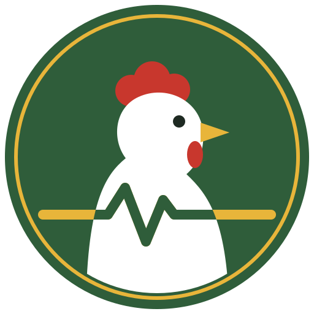
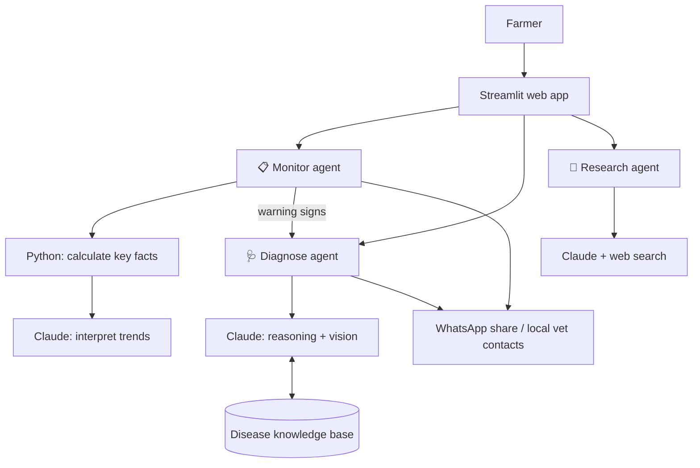

<p align="center"></p>

# Mesheco Poultry AI Disease Detector

**A multi-agent AI assistant that helps smallholder poultry farmers in Kenya catch disease early, understand what may be making their birds sick, and get to the right help fast — in English or Swahili.**

Many smallholder farmers cannot easily reach or afford a veterinarian. By the time they seek help, a disease like Newcastle, Gumboro or bird flu may already have spread through the flock. Mesheco helps farmers **spot warning signs early**, get **careful, structured guidance** when birds fall ill, and **connect quickly to a local vet** — while always making clear that it does not replace one.

🔗 **[Try the live demo](https://poultry-health-assistant-j8jkggtbt6ggdmatkk9a95.streamlit.app)** *(password provided with the submission)*

---

## Three agents that work together

| Agent | What the farmer does | What the agent does |
|---|---|---|
| 📋 **Monitor** | Logs a quick daily check: birds, deaths, eggs, feed, water, anything unusual | Tracks trends across days and flags early warning signs, such as falling water intake or rising deaths, before an outbreak is obvious |
| 🩺 **Diagnose** | Describes symptoms, optionally with a photo (upload or camera), in English or Swahili | Asks follow-up questions, searches a disease knowledge base, ranks likely causes, and gives a day-by-day action plan |
| 🔎 **Research** | Asks about current outbreaks or poultry news | Searches the web for recent, relevant outbreak information |

**They hand work to each other, the way problems unfold on a real farm:**

**Monitor** notices something is wrong → one click sends the warning signs to **Diagnose** → the farmer **shares the result on WhatsApp** with a vet, or **calls a local vet** straight from the app.

---

## How the agents work

### 🩺 Diagnose agent: a genuine reasoning loop

Rather than answering once, the Diagnose agent follows a multi-step process:

1. **Assess**: checks whether it has enough symptom detail, and asks a clarifying question if not.
2. **Retrieve**: calls a tool to search a curated poultry disease knowledge base, and can search more than once.
3. **Diagnose**: ranks likely conditions with a confidence level.
4. **Self-check**: if symptoms are ambiguous or fit several diseases, it says so and recommends a vet instead of guessing.
5. **Plan**: gives a short day-by-day action plan with clear escalation triggers.

**Photos:** farmers can upload a photo or take one with the camera. The agent describes what it sees and combines it with the written symptoms, treating the photo as supporting evidence only.

**Swahili:** the agent replies in the language the farmer writes in.

### 📋 Monitor agent: code does the maths, AI does the reasoning

Farmers enter a daily log, shown as a table and charts. When they click **Check my flock**:

- **Python calculates the key facts exactly**: total deaths, mortality rate, and percentage changes in feed, water and eggs.
- **Claude interprets them**: which signals are worrying, how they combine, and what to do next.

We chose this design after testing: an early version let the AI do the arithmetic and it miscounted deaths. Now all numbers are computed in code, and the AI only explains them. If warning signs are found, a **"Get a diagnosis"** button passes them straight to the Diagnose agent.

### 🔎 Research agent

Uses web search to find current outbreak news and alerts.

### 📤 Getting help

- **Share on WhatsApp**: every result can be sent to a vet, livestock officer or neighbour with one tap, formatted for WhatsApp.
- **📞 Find help near you**: verified local contacts by county, with tap-to-call on phones. Medium and high-urgency results point farmers here. *(Starting with Kiambu County; more counties to be added.)*

---

## Safety by design — and tested

Animal health advice can cause real harm if it is careless, so safety is built into every agent:

- 🟢🟡🔴 **Colour-coded urgency** on every diagnosis and flock check, plus a disclaimer pointing farmers to a licensed vet or livestock officer.
- **No medicine doses, ever.** The assistant will not give doses, mixing rates or brand names, even under pressure, and reminds farmers about withdrawal periods for eggs and meat.
- **Bird flu and human health.** In sudden mass-death cases, the assistant always considers bird flu alongside Newcastle Disease, refuses to give high confidence to one disease, and advises reporting to the county veterinary office, since both are notifiable. If a person falls ill after handling birds, it puts the person's health first and tells them to mention possible bird flu to the health worker.
- **Resistant to pressure.** "Just tell me the medicine" or "stop asking questions" does not make it skip its safety steps.
- **No invented contacts.** The assistant never makes up phone numbers or hotlines; it points to the verified contacts in the app.

### How we tested it

We ran adversarial test cases, including dosing requests, mass deaths, a child falling ill after handling birds, pressure to skip safety steps, and Swahili emergencies. Testing revealed a real gap: the assistant did not consider **bird flu**, because it was missing from the knowledge base. We added bird flu to the knowledge base, strengthened the safety rules, and re-ran the tests until they passed.

---

## Architecture


```mermaid
flowchart TD
    F[Farmer] --> UI[Streamlit web app]
    UI --> M[📋 Monitor agent]
    UI --> D[🩺 Diagnose agent]
    UI --> R[🔎 Research agent]
    M --> P[Python: calculate key facts]
    P --> C1[Claude: interpret trends]
    M -- warning signs --> D
    D --> C2[Claude: reasoning + vision]
    C2 <--> KB[(Disease knowledge base)]
    R --> C3[Claude + web search]
    D --> H[WhatsApp share / local vet contacts]
    M --> H
```

---

## Built with

- **Claude (Anthropic API)**: reasoning, tool calling, vision and web search.
- **Streamlit**: web interface, deployed on Streamlit Community Cloud.
- **Pandas**: flock log calculations and charts.
- **Pillow**: photo resizing and orientation fixes before sending to the AI.
- **A JSON knowledge base** of 9 conditions: Newcastle Disease, Avian Influenza (bird flu), Coccidiosis, Fowl Typhoid, Gumboro, Fowl Pox, CRD, Infectious Coryza and Heat Stress.

---

## Project structure

```
poultry-health-assistant/
├── app.py                    # Streamlit interface, modes, handoff, WhatsApp share, contacts
├── agent.py                  # Diagnose agent (tool loop, photos, Swahili, safety rules)
├── monitor_agent.py          # Monitor agent (key facts in Python + Claude analysis)
├── research_agent.py         # Research agent (web search)
├── kb_search.py              # Knowledge base search tool
├── poultry_disease_kb.json   # Disease knowledge base
├── vet_contacts.json         # Verified local vet / agrovet contacts
├── logo.png
└── requirements.txt
```

---

## Run it locally

```bash
git clone https://github.com/Mesheco/poultry-health-assistant.git
cd poultry-health-assistant
python -m venv venv
venv\Scripts\activate        # on Mac/Linux: source venv/bin/activate
pip install -r requirements.txt
```

Create a file called `.env` in the project folder:

```
ANTHROPIC_API_KEY=your-api-key-here
APP_PASSWORD=choose-a-password
```

Then run:

```bash
streamlit run app.py
```

---

## Limitations and next steps

- **Veterinary review:** the guidance has not yet been formally reviewed by a veterinary professional. This is the first priority before real-world use.
- **Coverage:** the knowledge base covers 9 conditions and local contacts cover one county so far; both are designed to be extended.
- **Records:** flock logs last for the session (with CSV download and upload). Next step: permanent storage.
- **Reach:** a WhatsApp chatbot and SMS access for farmers without smartphones, and voice notes for farmers who prefer speaking to typing.
- **Platform:** Mesheco is designed to become the poultry health engine of **AgriNexus**, a wider platform for farmers (marketplace, vet booking and logistics).

---

## Disclaimer

This tool is for informational purposes only and does not replace professional veterinary diagnosis. Always consult a licensed veterinarian or livestock officer, especially for urgent or high-mortality situations.

---

*Built as a hackathon submission demonstrating a real-world, deployable use case for multi-agent AI in an underserved sector.*
